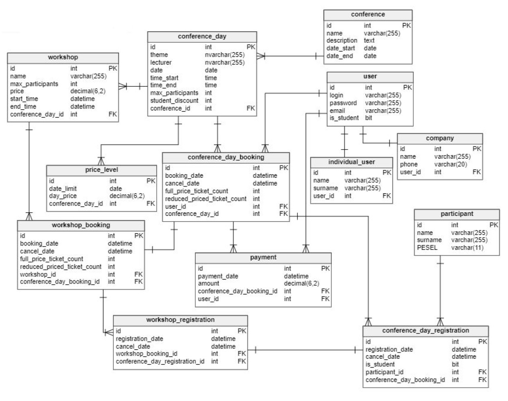

# Conferences managment system database

Aim of this project was to create database system for company who organize conferences. Clients can make bookings of slots for conference(specyfying: number of participating days, choosen workshops, number of participants) and make payment for them. Main task was to design system, which in the best way will fits company requierments.

## Roles  

Client: 
* Registration
* Booking conference and workshop
* Payment
* Cancelling booking
* Checking conferences
* Complement participants list
* Changing personal data

Employee:
* Generating invoices
* Generating identifiers
* Managing clients booking
* Adding conferences and workshops
* Displaying clients info
* Editing conference and workshop info
* Cancelling conferences and workshops
* Displaying info about conference
* Statistics and history

## Scheme

